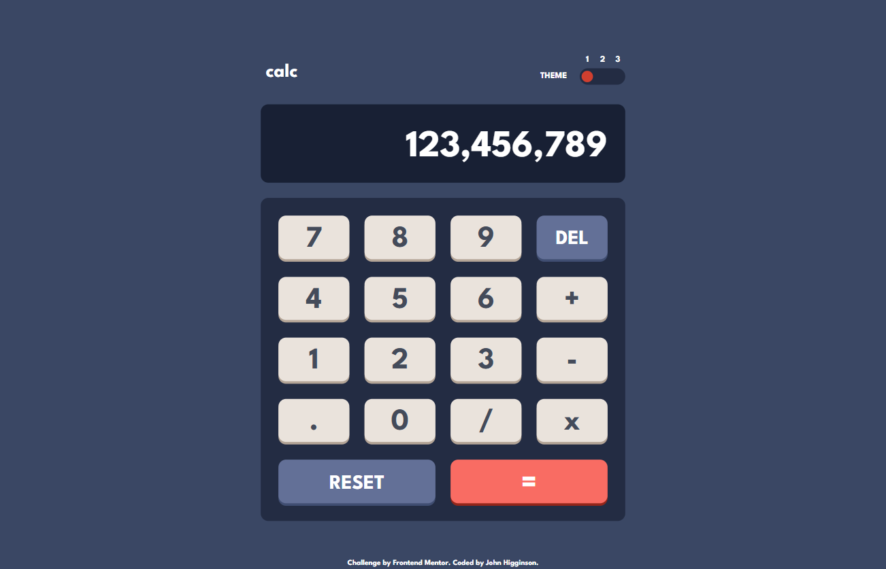

# Frontend Mentor - Calculator app solution

This is a solution to the [Calculator app challenge on Frontend Mentor](https://www.frontendmentor.io/challenges/calculator-app-9lteq5N29). Frontend Mentor challenges help you improve your coding skills by building realistic projects. 

## Table of contents

- [Overview](#overview)
  - [The challenge](#the-challenge)
  - [Screenshot](#screenshot)
  - [Links](#links)
- [My process](#my-process)
  - [Built with](#built-with)
  - [What I learned](#what-i-learned)
- [Author](#author)

## Overview

### The challenge

Users should be able to:

- See the size of the elements adjust based on their device's screen size
- Perform mathmatical operations like addition, subtraction, multiplication, and division
- Adjust the color theme based on their preference
- Have their initial theme preference checked using `prefers-color-scheme` and have any additional changes saved in the browser

### Screenshot

### Links

- Solution URL: [https://www.frontendmentor.io/solutions/calculator-developed-with-react-and-tailwind-css-31BamRxQPP](https://www.frontendmentor.io/solutions/calculator-developed-with-react-and-tailwind-css-31BamRxQPP)
- Live Site URL: [https://calculator-tailwind.vercel.app/](https://calculator-tailwind.vercel.app/)

## My process

### Built with

- Semantic HTML5 markup
- CSS variables
- Flexbox
- CSS Grid
- Mobile-first workflow
- [React](https://reactjs.org/) - JS library
- [Create React App](https://create-react-app.dev/) - React build stack
- [Tailwind CSS](https://tailwindcss.com/) - For styles

### What I learned

I used the project to learn Tailwind CSS. I found Tailwind fairly easy to use and customize, but I probably would just use plain CSS or SASS for another project this small.

It was also a good way to practice the useReducer React hook to implement the logic of the calculator and saving color themes with css variables. 

## Author

- Frontend Mentor Profile - [@jhigginson](https://www.frontendmentor.io/profile/jhigginson)
- [LinkedIn](https://www.linkedin.com/in/johnmhigginson/)
