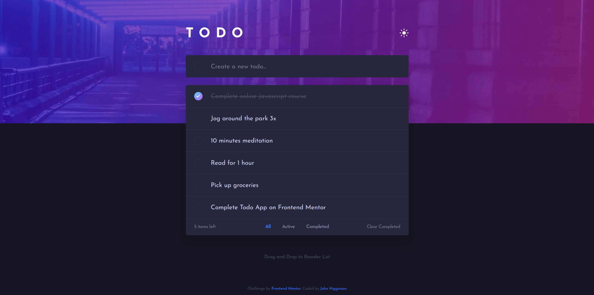

# Frontend Mentor - Todo app solution

This is a solution to the [Todo app challenge on Frontend Mentor](https://www.frontendmentor.io/challenges/todo-app-Su1_KokOW). Frontend Mentor challenges help you improve your coding skills by building realistic projects. 

## Table of contents

- [Overview](#overview)
  - [The challenge](#the-challenge)
  - [Screenshot](#screenshot)
  - [Links](#links)
- [My process](#my-process)
  - [Built with](#built-with)

## Overview

### The challenge

Users should be able to:

- View the optimal layout for the app depending on their device's screen size
- See hover states for all interactive elements on the page
- Add new todos to the list
- Mark todos as complete
- Delete todos from the list
- Filter by all/active/complete todos
- Clear all completed todos
- Toggle light and dark mode
- Drag and drop to reorder items on the list (desktop browsers only)

### Screenshot

### Links

- Solution URL: [https://www.frontendmentor.io/solutions/nextjs-react-with-responsive-design-dark-mode-and-drag-and-drop-AgJt8L6r_j](https://www.frontendmentor.io/solutions/nextjs-react-with-responsive-design-dark-mode-and-drag-and-drop-AgJt8L6r_j)
- Live Site URL: [https://frontend-mentor-todo-rho.vercel.app](https://frontend-mentor-todo-rho.vercel.app)

## My process

### Built with

- Semantic HTML5 markup
- CSS Animations
- Flexbox
- Mobile-first workflow
- [React](https://reactjs.org/) - JS library
- [Next.js](https://nextjs.org/) - React framework
- [React-Transition-Group](https://reactcommunity.org/react-transition-group/) - Animation Library

### What I learned

- practice writing CSS and finely matching details to a design image
- practice implementing responsive design
- CSS Animations with and without React-transition-group
- practice with Next.js
- practice working with React features like hooks and context

## Author

- Frontend Mentor - [@jhigginson](https://www.frontendmentor.io/profile/jhigginson)
- [LinkedIn](https://www.linkedin.com/in/johnmhigginson/)